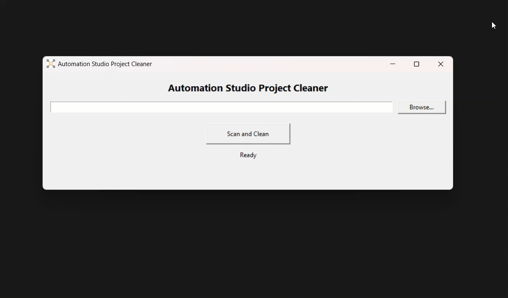

# Automation Studio Project Cleaner
A small Windows utility for cleaning generated folders from B&R Automation Studio projects


<div align="center">
  <a href="https://github.com/br-automation-community/as-project-cleaner/releases/latest">
    
  </a>

  <a href="https://github.com/br-automation-community/as-project-cleaner/issues">
    
  </a>
</div>

## What it does

The tool recursively scans a selected directory for Automation Studio
projects identified by an `.apj` file.

For each detected project, it can delete:

- `Temp`
- `Binaries`
- `Diagnosis`

It does not delete:

- `.apj` files
- `Logical`
- `Physical`
- other project files

The user must confirm the cleanup before anything is deleted.

## Running the application

### Windows executable

[Download the latest release](https://github.com/br-automation-community/as-project-cleaner/releases/latest) → Download the `.zip` file → Extract it → Run `ASProjectCleaner.exe`

No Python installation is required.

### Running from source

Requires Python 3.14 or newer.

```powershell
pip install -r requirements-dev.txt
python src/ASProjectCleaner.py
